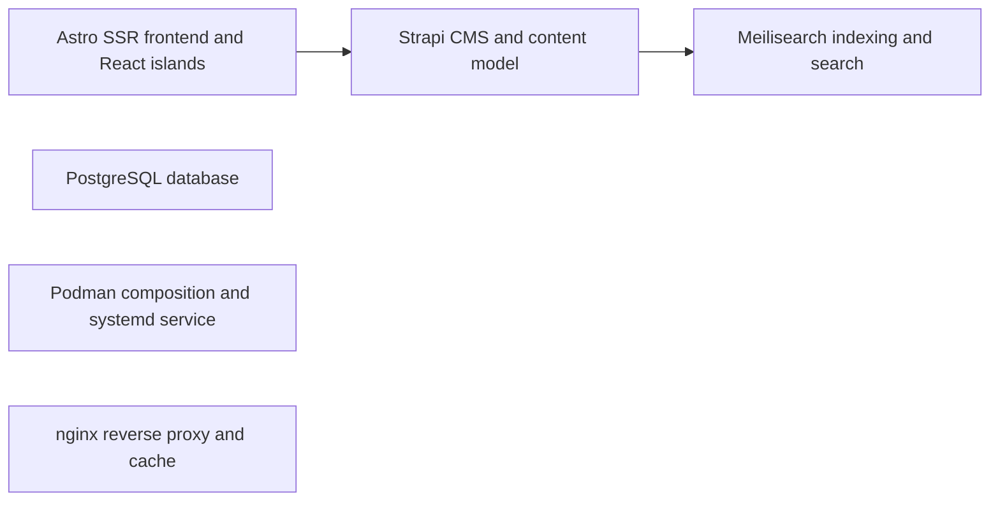

# Container diagram

```mermaid
flowchart LR
    Component1["Astro SSR frontend and React islands"]
    Component2["Strapi CMS and content model"]
    Component3["Meilisearch indexing and search"]
    Component4["PostgreSQL database"]
    Component5["Podman composition and systemd service"]
    Component6["nginx reverse proxy and cache"]
    Component1 --> Component2
    Component2 --> Component3
```
