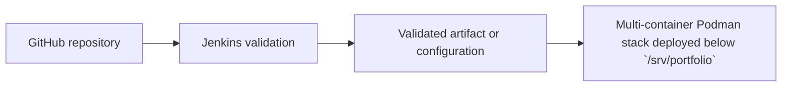

# Deployment diagram

```mermaid
flowchart LR
    Source["GitHub repository"] --> Jenkins["Jenkins validation"]
    Jenkins --> Artifact["Validated artifact or configuration"]
    Artifact --> Runtime["Multi-container Podman stack deployed below `/srv/portfolio`"]
```
