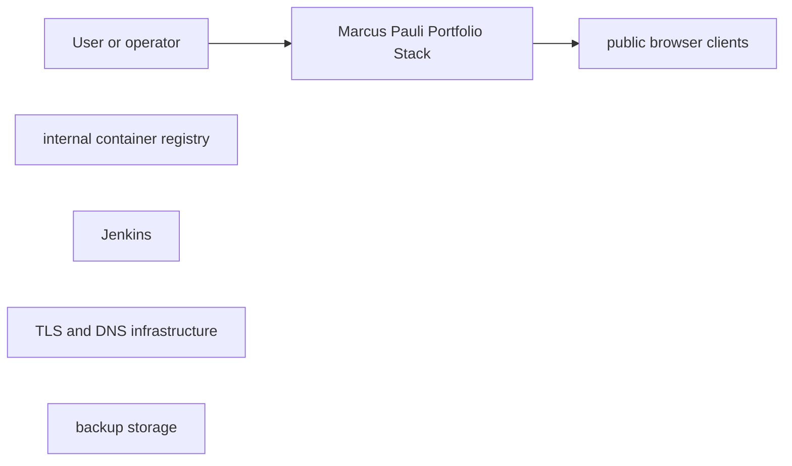

# System context diagram

```mermaid
flowchart LR
    User["User or operator"] --> Project["Marcus Pauli Portfolio Stack"]
    External1["public browser clients"]
    External2["internal container registry"]
    External3["Jenkins"]
    External4["TLS and DNS infrastructure"]
    External5["backup storage"]
    Project --> External1
```
